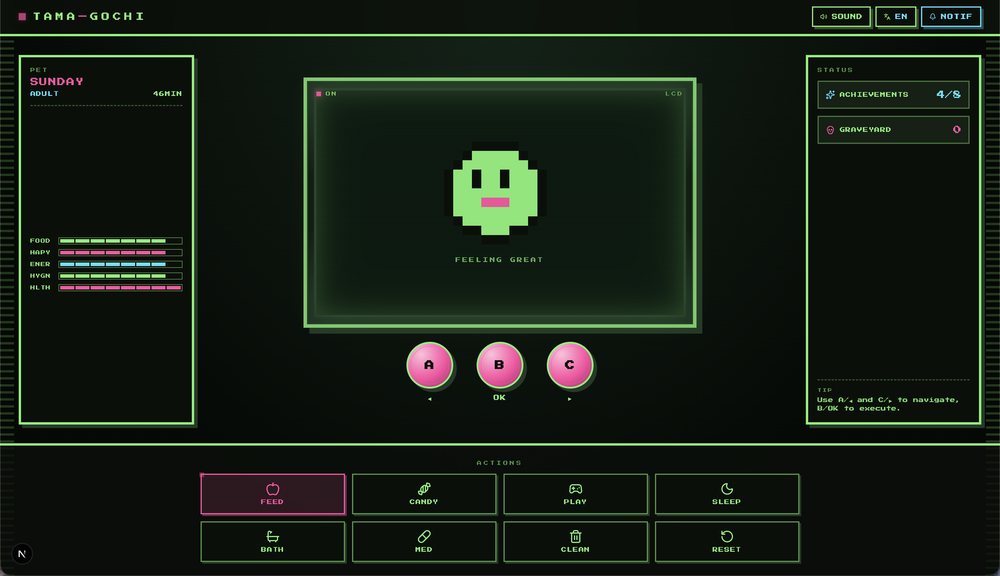

# 🥚 Tamagochi — Retro Pet



**Lembra daquele bichinho virtual preso no chaveiro dos anos 90 que vivia
pedindo comida no meio da aula?** A gente trouxe ele de volta — com toda a
alma LCD verde-fosforescente, bipes 8-bit e a ansiedade gostosa de não saber
se o seu mascote vai passar da adolescência.

Cuide do ovo, veja ele chocar, escolha entre três espécies, brinque, alimente,
dê banho, remédio, limpe a bagunça, coloque pra dormir — e torça pra que
ele não morra de fome enquanto você "só deu uma olhadinha no celular".

É o jogo perfeito pra encaixar naquela hora morta do dia:

- 🚇 Fila do mercado, ponto de ônibus, elevador preso
- ☕ Cinco minutos entre reuniões
- 🎓 Aquela aula que ninguém presta atenção
- 🛌 Antes de dormir, quando o sono não vem
- 🕒 Qualquer pausa de 30 segundos que você quer matar com dignidade

## 🎮 Pra começar a jogar

```bash
npm install
npm run dev
```

Abra no navegador, dê um nome bonito (ou ridículo, a gente não julga), escolha
sua espécie favorita — **BLOB** (o clássico amorfo verde), **DINO** (o ciano
saudoso) ou **CAT** (o rosa fofo) — e não esqueça de aceitar o som **assim que
a música tocar**. Pixel art sem chiptune é só metade da experiência.

## ✨ O que tem dentro

- **Ciclo de vida completo**: ovo → bebê → criança → adolescente → adulto → ancião
- **Cinco stats que não te deixam em paz**: fome, felicidade, energia, higiene, saúde
- **Ele continua passando fome mesmo com a aba fechada** (tipo bichinho de verdade)
- **Mini-game da adivinhação** pra levantar o humor quando ele emburra
- **Cemitério** com o histórico de cada alma que se foi (e a causa, pra você
  se culpar direitinho)
- **Conquistas** pra quem é dessas de platinar tudo
- **Notificações do navegador** quando ele está em perigo (opcional, prometemos
  não encher o saco)
- **Música de abertura arcade** em loop na tela inicial
- **Três idiomas**: Português 🇧🇷, Português 🇵🇹 e Inglês 🇺🇸
- **Funciona offline depois da primeira carga**, porque tudo vive no próprio
  navegador

## 💾 Os dados ficam com você

Não tem login, cadastro, servidor, cookie maluco. Tudo fica salvo no seu
navegador — se você limpar o histórico, seu bichinho vai pro além. Sinta-se
livre pra abrir, fechar e voltar dias depois; ele vai estar lá (provavelmente
um pouco faminto).

## 🕹️ Dicas rápidas

- **Doce engorda a felicidade mas pode dar dor de barriga** — use com moderação
- **Sono cura quase tudo** — se ele tá de mau humor, coloca ele pra dormir
- **Cocô acumulado mata a higiene rápido** — passa o botão de limpar
- **Remédio só funciona quando ele tá doente** — não desperdice

## ❤️ Feito com carinho

Projeto pessoal feito pra matar saudade do que era simples e viciante.
Contribua, forqueie, suba o seu próprio bichinho — ou só jogue mesmo e
mande foto do recorde de idade no cemitério.

Boa sorte, cuidador. Seu bichinho tá te esperando. 🥚✨
